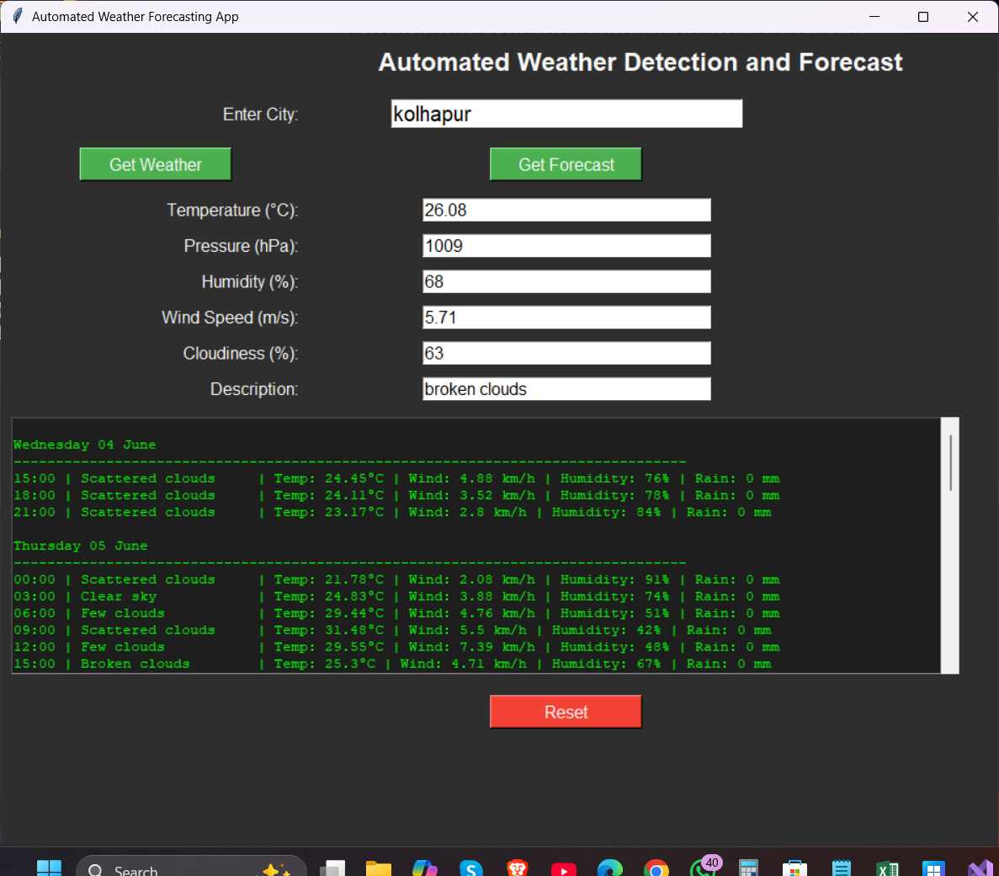

# Weather Forecasting App

This is a simple weather forecasting desktop application built using Python.  
It uses an API to fetch real-time weather data based on the user's city input.

---

### Project Info

- **Created:** 2023  
- **Updated & Uploaded to GitHub:** 2025  
- This project was originally built two years ago as a part of my learning journey.

---

### 🖼️ Screenshots

#### Home Screen

#### Result Screen

#### Error Message

---

### Technologies Used
- Python
- Tkinter
- `requests` library
- OpenWeatherMap API

## Features
- Search city weather
- Displays temperature, humidity, wind speed, and weather description

## Setup
- Clone repo
- Run `pip install requests`
- Run app: `python weather_app.py`
